# SynchBank — Modern Android Banking App

> A production-grade Android banking application demonstrating Server-Driven UI, MVI architecture, clean multi-module design, and a fully composable design system.

**Author:** Gokulakrishnan Mani
**Platform:** Android (minSdk 24 · targetSdk 36)
**Language:** Kotlin
**UI Toolkit:** Jetpack Compose + Material3

---

## Table of Contents

1. [Project Overview](#1-project-overview)
2. [Architecture Overview](#2-architecture-overview)
3. [Module Structure](#3-module-structure)
4. [Server-Driven UI (SDUI) Engine](#4-server-driven-ui-sdui-engine)
5. [MVI Data Flow](#5-mvi-data-flow)
6. [Navigation System](#6-navigation-system)
7. [Design System](#7-design-system)
8. [Feature Modules](#8-feature-modules)
9. [Core Modules](#9-core-modules)
10. [Libraries Used](#10-libraries-used)
11. [App Functionality](#11-app-functionality)
12. [Project Setup](#12-project-setup)

---

## 1. Project Overview

SynchBank is a full-featured mobile banking application built for Android. The app is architected around three core engineering pillars:

- **Server-Driven UI (SDUI):** Every screen is defined in JSON. The app parses JSON at runtime and renders composable components dynamically. This eliminates hardcoded layouts and allows UI changes without an APK release.
- **MVI (Model-View-Intent):** Strict unidirectional data flow. State is immutable, user actions are sealed-class Intents, and side effects (navigation, dialogs) are sealed-class Effects emitted once and consumed.
- **Clean Multi-Module Architecture:** The project is split into 10 Gradle modules across four layers — core libraries, engine subsystems, feature modules, and the application shell — enforcing strict dependency boundaries.

---

## 2. Architecture Overview

```
┌─────────────────────────────────────────────────┐
│                    :app                          │
│   MainActivity · ArchitectNavHost · MainScreen   │
└────────────────────┬────────────────────────────┘
                     │ depends on all modules
        ┌────────────┴─────────────┐
        │                          │
┌───────▼───────┐        ┌─────────▼──────────┐
│  :engine:sdui │        │  :engine:navigation │
│  SDUI Parser  │        │  NavigationEngine   │
│  Component    │        │  NavigationAction   │
│  Registry     │        │  Routes             │
│  SDUIRenderer │        └────────────────────┘
└───────┬───────┘
        │ used by all features
┌───────▼──────────────────────────────────────┐
│              Feature Modules                  │
│  :feature:login    :feature:dashboard         │
│  :feature:payments :feature:accounts          │
│  :feature:profile                             │
└───────────────────────────────────────────────┘
        │ depend on core
┌───────▼──────────────────────────────────────┐
│               Core Modules                    │
│  :core:domain   :core:ui                      │
│  :core:network  :core:data                    │
└───────────────────────────────────────────────┘
```

### Layered Clean Architecture

| Layer | Modules | Responsibility |
|---|---|---|
| **Presentation** | `:app`, all `:feature:*` | Compose screens, ViewModels, MVI state |
| **Engine** | `:engine:sdui`, `:engine:navigation` | Reusable subsystems (UI rendering, routing) |
| **Domain** | `:core:domain` | Business rules, models, use case contracts |
| **Data** | `:core:data`, `:core:network` | API, Room database, repository implementations |
| **Design** | `:core:ui` | Design tokens, shared Compose components |

### Key Architectural Principles

- **Unidirectional Data Flow** — UI dispatches Intents → ViewModel reduces to new State → UI re-renders
- **Single Source of Truth** — `StateFlow` holds screen state; collected with lifecycle awareness
- **One-Shot Effects** — Navigation and dialogs go through `Channel<Effect>` (never replayed)
- **Open/Closed Principle** — `ComponentRegistry` is open for extension (add new component types) without modifying existing registrations
- **Dependency Rule** — Inner layers (domain, data) never depend on outer layers (UI, features)

---

## 3. Module Structure

```
SynchBank/
├── app/                          # Application shell (single-activity)
├── core/
│   ├── domain/                   # Pure Kotlin: models, base classes, interfaces
│   ├── ui/                       # Design tokens, shared Compose components
│   ├── network/                  # Retrofit, OkHttp, mock interceptor, mock JSON assets
│   └── data/                     # Room database, repository implementations, DAOs
├── engine/
│   ├── sdui/                     # Full Server-Driven UI rendering engine
│   └── navigation/               # Navigation abstraction layer
└── feature/
    ├── login/                    # Authentication screen + use cases
    ├── dashboard/                # Home dashboard with charts and quick actions
    ├── payments/                 # Transfer funds + add beneficiary flow
    ├── accounts/                 # Account list + recent activity
    └── profile/                  # User profile, settings, biometric toggle
```

### Dependency Graph

```
:app
  └── :feature:login, :feature:dashboard, :feature:payments,
      :feature:accounts, :feature:profile
        └── :engine:sdui, :engine:navigation
              └── :core:domain, :core:ui, :core:network, :core:data
```

Each feature module only knows about `:core:domain`, `:core:ui`, `:engine:sdui`, and `:engine:navigation`. Features never depend on each other.

---

## 4. Server-Driven UI (SDUI) Engine

The SDUI engine is the centrepiece of SynchBank. All screens are defined in JSON and rendered dynamically at runtime. No screen has hardcoded layouts.

### How It Works

```
JSON String  ──►  SDUIParser  ──►  ScreenModel  ──►  SDUIRenderer  ──►  Compose UI
(from asset/API)                  (domain model)   (ComponentRegistry)
```

**Step 1 — Parse:** `SDUIParser.parse(json)` deserialises the JSON string into a typed `ScreenModel` using Kotlinx Serialization with `ignoreUnknownKeys = true` (forward-compatible with new server fields).

**Step 2 — Render:** `SDUIRenderer` composable receives the `ScreenModel` and:
- Shows a `CircularProgressIndicator` during loading
- Applies the layout type (`SCROLL`, `LAZY_COLUMN`, or `COLUMN`) with screen-level padding
- Renders the optional `header` component outside the scrollable area
- Renders each visible component in order by calling `ComponentRegistry.renderComponent()`

**Step 3 — Dispatch:** User interactions call `onAction(actionId: String)`. The ViewModel looks up the action in `screenModel.actions`, resolves the `ActionModel`, and executes it (navigate, show dialog, make API call, etc.).

### ScreenModel Structure

```kotlin
ScreenModel(
    screenId = "dashboard",
    version  = "1.0",
    metadata = ScreenMetadata(title = "Home", analyticsTag = "dashboard_screen"),
    layout   = LayoutModel(type = SCROLL, padding = LayoutPadding(horizontal=20, vertical=16)),
    header   = ComponentModel(type = HEADER_BAR, ...),
    components = listOf(
        ComponentModel(id = "balance_header", type = BALANCE_HEADER, props = {...}),
        ComponentModel(id = "quick_actions", type = ROW, children = [...]),
        ...
    ),
    actions = mapOf(
        "TRANSFER" to ActionModel(type = NAVIGATE, destination = "transfer"),
        "LOGOUT"   to ActionModel(type = API_CALL, endpoint = "/auth/logout", ...)
    )
)
```

### Component Types (32 total)

| Category | Components |
|---|---|
| **Layout** | `ROW`, `COLUMN`, `CARD`, `SPACER`, `DIVIDER` |
| **Text & Input** | `TEXT`, `TEXT_FIELD`, `LINK_TEXT` |
| **Actions** | `BUTTON`, `ICON_BUTTON`, `LOGOUT_BUTTON` |
| **Media** | `IMAGE`, `ICON` |
| **Data Display** | `LINE_CHART`, `ACTIVITY_ITEM` |
| **Header** | `HEADER_BAR` |
| **Auth** | `BIOMETRIC_ROW` |
| **Dashboard** | `BALANCE_HEADER`, `RECENT_ACTIVITY_CARD` |
| **Payments** | `SOURCE_ACCOUNT_SELECTOR`, `AMOUNT_INPUT_CARD`, `SECTION_HEADER_ROW`, `BENEFICIARY_GRID`, `TRANSFER_LIMIT_BANNER`, `TRANSFER_PROGRESS`, `ADD_BENEFICIARY_FORM`, `VERIFICATION_CARD` |
| **Accounts** | `ACCOUNT_CARD` |
| **Profile** | `PROFILE_AVATAR_HEADER`, `PROFILE_INFO_CARD`, `PROFILE_SETTINGS_CARD` |

### Action Types

| Action | Behaviour |
|---|---|
| `NAVIGATE` | Push/replace a new screen via `NavigationEngine` |
| `API_CALL` | Hit an API endpoint; chain `onSuccess`/`onError` actions |
| `SHOW_DIALOG` | Display an `AlertDialog` with a server-defined message |
| `DEEP_LINK` | Navigate via custom URI scheme (`architect://...`) |
| `SUBMIT_FORM` | Validate and submit a form |
| `BIOMETRIC_AUTH` | Trigger system biometric prompt |
| `LOCAL_STATE` | Update local UI state without server round-trip |
| `DISMISS` | Close an overlay or dialog |

### Dynamic Component Patching

ViewModels can update live component data without re-parsing the full screen. For example, `TransferViewModel` patches the `BENEFICIARY_GRID` component in-memory when a new beneficiary is added:

```kotlin
private fun ScreenModel.withPatchedBeneficiaryGrid(beneficiaries: List<Beneficiary>): ScreenModel {
    return copy(
        components = components.map { comp ->
            if (comp.type == SduiComponentType.BENEFICIARY_GRID) {
                val newProps = buildJsonObject {
                    comp.props.forEach { (key, value) -> put(key, value) }
                    put("items", buildJsonArray {
                        beneficiaries.forEach { b -> add(buildJsonObject { put("id", b.id); ... }) }
                    })
                }
                comp.copy(props = newProps)
            } else comp
        }
    )
}
```

The same pattern is used to update the profile avatar after the user picks a photo.

### Mock Data

All screens and API responses are served from JSON files under `core/network/src/main/assets/mock/`. The `MockInterceptor` (OkHttp) intercepts every Retrofit call and returns the matching mock file. Swapping to a real backend only requires removing the interceptor — no business logic changes.

---

## 5. MVI Data Flow

Every feature module follows the same strict MVI contract.

### The Three Types

```kotlin
interface UiState     // immutable data class
interface UiIntent    // sealed class — user actions
interface UiEffect    // sealed class — one-shot side effects
```

### BaseViewModel

```kotlin
abstract class BaseViewModel<S : UiState, I : UiIntent, E : UiEffect> : ViewModel() {

    private val _state = MutableStateFlow(initialState())
    val state: StateFlow<S> = _state.asStateFlow()

    private val _effect = Channel<E>(Channel.BUFFERED)
    val effect: Flow<E> = _effect.receiveAsFlow()

    fun handleIntent(intent: I) {
        viewModelScope.launch { reduce(intent) }
    }

    protected abstract suspend fun reduce(intent: I)

    protected fun setState(block: S.() -> S) {
        _state.update { it.block() }
    }

    protected suspend fun setEffect(effect: E) {
        _effect.send(effect)
    }
}
```

### Full Data Flow Example — Login

```
User types email
       │
       ▼
LoginScreen.onValueChange()
       │  dispatches
       ▼
viewModel.handleIntent(LoginIntent.UsernameChanged("user@example.com"))
       │  coroutine launched
       ▼
LoginViewModel.reduce(UsernameChanged)
       │  setState { copy(usernameInput = intent.value) }
       ▼
_state.update(newState)
       │  StateFlow emits
       ▼
LoginScreen collectAsStateWithLifecycle()
       │  Compose recompose
       ▼
SDUIRenderer re-renders with updated field value

─────────────────────────────────────────────────────

User taps "Sign In"
       │
       ▼
LoginScreen calls viewModel.handleIntent(LoginIntent.Submit)
       │
       ▼
LoginViewModel.reduce(Submit)
  │  validate inputs
  │  call LoginUseCase → API → Result.Success
  │  setEffect(LoginEffect.NavigateToDashboard)
       │
       ▼
effect channel receives NavigateToDashboard
       │
       ▼
LoginScreen LaunchedEffect { effect.collect { ... } }
  │  NavigationEngine.navigate(navController, NavigationAction(REPLACE, Routes.MAIN))
       │
       ▼
NavController replaces LOGIN with MAIN (bottom nav shell)
       └── back stack cleared (no back to login after auth)
```

### State vs Effect

| | State | Effect |
|---|---|---|
| **Type** | `StateFlow` (hot, replayed) | `Channel` / `Flow` (cold, consumed once) |
| **Use for** | UI data (text, loading, error, lists) | Navigation, toasts, dialogs, system calls |
| **Lifecycle** | Survives recomposition | Consumed exactly once then gone |
| **Example** | `isLoading = true`, `screenModel = ...` | `Navigate(action)`, `ShowDialog(msg)` |

---

## 6. Navigation System

### NavigationEngine

All navigation is centralised in `NavigationEngine` — the only class that calls `NavController.navigate()`. Features emit `NavigationAction` effects; the screen layer passes them to the engine.

```kotlin
object NavigationEngine {
    fun navigate(navController: NavController, action: NavigationAction) {
        when (action.type) {
            PUSH      -> navController.navigate(action.destination, buildNavOptions(action))
            REPLACE   -> navController.navigate(action.destination) { popUpTo(0) { inclusive = true } }
            POP       -> navController.popBackStack()
            DEEP_LINK -> navController.navigate(NavDeepLinkRequest.Builder.fromUri(Uri.parse(action.deepLink)).build())
            MODAL     -> navController.navigate(action.destination)
        }
    }
}
```

### Route Constants

All routes are defined in a single `Routes` object:

```kotlin
object Routes {
    const val LOGIN           = "login"
    const val MAIN            = "main"
    const val DASHBOARD       = "dashboard"
    const val PROFILE         = "profile"
    const val ACCOUNTS        = "accounts"
    const val ACCOUNT_DETAIL  = "account/{accountId}"
    const val TRANSFER        = "transfer"
    const val TRANSACTIONS    = "transactions"
    const val FORGOT_PASSWORD = "forgot_password"

    fun accountDetail(accountId: String) = "account/$accountId"
}
```

### Navigation Graph

```
RootNavHost (startDestination = LOGIN)
│
├── LOGIN ──────────────────► MAIN (replace, back stack cleared)
│
└── MAIN
    └── MainScreen (bottom tabs)
        ├── TAB_HOME      → DashboardScreen
        ├── TAB_PAYMENTS  → PaymentsNavHost
        │     ├── TRANSFER
        │     └── ADD_BENEFICIARY (nested push)
        ├── TAB_ACCOUNTS  → AccountsScreen
        └── TAB_PROFILE   → ProfileScreen
```

The Payments tab uses a **nested NavHost** so users can navigate Transfer → Add Beneficiary and back without disturbing the bottom navigation bar.

---

## 7. Design System

### ArchitectColors — Design Tokens

```kotlin
object ArchitectColors {
    // Primaries
    val NavyPrimary    = Color(0xFF0A1F3C)  // deep navy — headers, primary text
    val NavySecondary  = Color(0xFF1B2E42)  // slightly lighter navy
    val GoldAccent     = Color(0xFFC9A84C)  // gold — premium accents
    val TealAccent     = Color(0xFF3ABFBF)  // teal — interactive elements

    // Surfaces
    val White          = Color(0xFFFFFFFF)
    val OffWhite       = Color(0xFFEDEBE6)  // warm beige — screen backgrounds
    val WarmSurface    = Color(0xFFE7E8EA)  // cool light — secondary surfaces
    val FormCardBg     = Color(0xFFF0F2F4)  // form input backgrounds
    val LightGray      = Color(0xFFE5E7EB)  // dividers, borders

    // Semantic
    val Success        = Color(0xFF22C55E)  // positive amounts, success states
    val Error          = Color(0xFFEF4444)  // destructive, negative amounts
    val Warning        = Color(0xFFF59E0B)  // caution banners
    val MediumGray     = Color(0xFF6B7280)  // secondary text, captions
    // ...and 20+ more tokens
}
```

### ArchitectTypography

| Style | Usage |
|---|---|
| `Display` | Large hero numbers (account balance) |
| `Heading1` | Screen titles |
| `Heading2` | Section headers |
| `Heading3` | Card titles |
| `Body` | Primary content text |
| `BodySmall` | Secondary descriptions |
| `Caption` | Timestamps, metadata |
| `Label` | ALL-CAPS section labels |
| `ButtonText` | Buttons |

### ArchTextField

A custom-built text field component supporting:
- **Variants:** Outlined (login) / Filled (form inputs)
- **Input types:** `TEXT`, `EMAIL`, `PASSWORD`, `PHONE`, `NUMBER`
- **Password toggle:** show/hide with eye icon
- **IME actions:** `ImeAction.Done` for password fields, `ImeAction.Next` for all others
- **Error states:** red border + supporting error text
- **Unfocused border:** darker `NavySecondary` colour for better visibility

### ArchButton

Four button styles:
- **PRIMARY:** filled navy background, white text
- **SECONDARY:** outlined navy border, navy text
- **GHOST:** no border, teal text
- **DESTRUCTIVE:** outlined gray border, red icon + text (used for Log Out)

---

## 8. Feature Modules

### feature:login

**Purpose:** Authentication screen with email/password login, biometric options, and forgot-password flow.

**Key Behaviour:**
- Loads `login_screen.json` via `SDUIParser` — all fields, buttons, and biometric tiles are server-defined
- Validates email format and password length before API call via `LoginUseCase`
- On success: replaces back stack, navigates to `MAIN` (cannot go back to login)
- Biometric option reads `biometric_login_enabled` from SharedPreferences — if disabled, biometric tiles show grayed/warm surface styling with a "Biometric login disabled" toast on tap
- Password field IME action is `Done` (dismisses keyboard)
- Login input border uses darker `NavySecondary` color for contrast

**State / Intent / Effect:**

```
State:  isLoading, error, screenModel, usernameInput, passwordInput, isBiometricAvailable
Intent: LoadScreen, UsernameChanged, PasswordChanged, Submit, ForgotPassword,
        BiometricSelected, BiometricLoginSuccess, HandleAction, ClearError
Effect: NavigateToDashboard, NavigateToForgotPassword, NavigateToInquire,
        ShowBiometricPrompt, ShowError, ShowValidationError
```

**Data Layer:**
- `LoginApiService` — Retrofit interface (`POST /auth/login`)
- `LoginRepositoryImpl` — calls API, maps DTO to domain `AuthSession`
- `LoginMapper` — `LoginResponseDto → AuthSession`
- `LoginUseCase` — validate + call repository
- `SessionDao` + `SessionEntity` — persist token in Room

---

### feature:dashboard

**Purpose:** Home screen showing balance overview, spending chart, quick action buttons, and recent activity.

**Key Behaviour:**
- Loads `dashboard_screen.json` — full screen layout including chart data, quick-action buttons, and activity items
- Quick action "Transfer" switches to the Payments tab (`tab_payments`)
- Quick action "Search" and "Notifications" show "coming soon" toasts (placeholder)
- Account detail tap navigates to `ACCOUNT_DETAIL` route
- All layout, copy, and data driven entirely from JSON — no hardcoded strings or UI

**State / Intent / Effect:**

```
State:  isLoading, error, screenModel
Intent: LoadScreen, HandleAction
Effect: Navigate(NavigationAction), ShowDialog(message)
```

---

### feature:payments

**Purpose:** Fund transfer flow with source account selection, beneficiary grid, amount entry, and add-beneficiary sub-flow.

**Transfer Screen:**
- Source account selector (dropdown — fetches from `GET /source-accounts`)
- Beneficiary grid — live-updating tile grid from `BeneficiaryStore`
- Amount input with currency card
- Transfer limit warning banner
- Step progress indicator (multi-step transfer flow)
- Submit dispatches `SubmitTransferUseCase`

**Add Beneficiary Screen:**
- Full form: name, account number, IFSC/sort code, nickname
- Validated with `FormValidator` before submission
- On success: `BeneficiaryStore` updated → Transfer screen's grid patches in real-time (reactive StateFlow)
- Nested `NavHost` inside Payments tab keeps bottom nav visible

**BeneficiaryStore** — `@Singleton` reactive store:
```kotlin
@Singleton
class BeneficiaryStore @Inject constructor() {
    private val _beneficiaries = MutableStateFlow<List<Beneficiary>>(emptyList())
    val beneficiaries: StateFlow<List<Beneficiary>> = _beneficiaries.asStateFlow()

    fun add(beneficiary: Beneficiary) {
        _beneficiaries.update { it + beneficiary }
    }
}
```

**State / Intent / Effect:**

```
TransferState:  screenModel, isLoading, error, selectedAccountId,
                selectedBeneficiaryId, amount, note
TransferIntent: LoadScreen, HandleAction
TransferEffect: Navigate, ShowToast, ShowDialog

AddBeneficiaryState:  screenModel, isLoading, error, formFields
AddBeneficiaryIntent: LoadScreen, HandleAction, FieldChanged
AddBeneficiaryEffect: Navigate, ShowDialog, ShowToast
```

---

### feature:accounts

**Purpose:** Account overview screen — lists all user bank accounts with balance and recent activity cards.

**Key Behaviour:**
- Loads `accounts_screen.json`
- Each account rendered as an individual `ACCOUNT_CARD` component
  - WHITE theme cards: dark navy icon box background + white icon
  - DARK theme cards: translucent teal icon box + teal icon
- Recent activity section: each transaction item is a separate white `Surface` card with `RoundedCornerShape(16.dp)` and `shadowElevation = 2.dp` (not a single card with dividers)
- Balance displayed prominently with trend indicator

**State / Intent / Effect:**

```
State:  screenModel, isLoading, error
Intent: LoadScreen, HandleAction
Effect: Navigate, ShowToast
```

---

### feature:profile

**Purpose:** User profile screen with avatar, personal info, security settings, app preferences, and logout.

**Key Behaviour:**

**Profile Avatar:**
- Displays initials placeholder by default
- Edit badge taps → checks camera permission via `ActivityResultContracts.RequestPermission`
- If already granted → shows `ModalBottomSheet` directly; no re-prompt
- Bottom sheet options: "Open Camera" (`TakePicture`) and "Choose from Gallery" (`PickVisualMedia`)
- Selected photo stored as `profileImageUri` in state; `PROFILE_AVATAR_HEADER` props patched via `withPatchedAvatarImage(uri)` so Coil `AsyncImage` renders it immediately

**Biometric Toggle:**
- `PROFILE_SETTINGS_CARD` reads initial toggle state from `SharedPreferences("architect_prefs", "biometric_login_enabled")`
- On change: writes back to SharedPreferences; Login screen reads the same key and grays biometric tiles accordingly

**Settings Rows:**
- Appearance → opens `Settings.ACTION_DISPLAY_SETTINGS` (dark/light mode system settings)
- Language → opens `Settings.ACTION_LOCALE_SETTINGS` (language picker); dynamically shows current locale (`Locale.getDefault().displayLanguage + country`)
- Change Password, Push Notifications → `SHOW_DIALOG` actions (placeholder)

**Logout:**
- Styled as `OutlinedButton` with `BorderStroke(1.dp, LightGray)`, red icon + text (`ArchitectColors.Error`)
- Triggers `API_CALL` action → on success navigates back to login

**State / Intent / Effect:**

```
State:  screenModel, isLoading, error, profileImageUri
Intent: LoadScreen, HandleAction, UpdateProfileImage(uri)
Effect: Navigate, ShowDialog, LaunchLanguageSettings, LaunchDisplaySettings
```

---

## 9. Core Modules

### core:domain

Pure Kotlin module. No Android imports. The heart of the business logic.

**BaseViewModel<S, I, E>**
- Abstract ViewModel with `StateFlow<S>` for state and `Channel<E>` for effects
- `handleIntent(intent)` launches a coroutine that calls `reduce(intent)`
- `setState { copy(...) }` atomically updates state via `MutableStateFlow.update`
- `setEffect(effect)` sends one-shot events via `Channel.BUFFERED`

**Result<T>**
```kotlin
sealed class Result<out T> {
    data class Success<T>(val data: T) : Result<T>()
    data class Error(val code: Int? = null, val message: String) : Result<Nothing>()
    object Loading : Result<Nothing>()
}
```
Extension functions: `map()`, `onSuccess {}`, `onError {}`.

**Domain Models:**
- `AuthSession(userId, token, refreshToken, expiresAt)` — authenticated user session
- `Account` — bank account details
- `Transaction` — individual transaction record

**Repository Interfaces:**
- `LoginRepository` — defines `login(email, password): Result<AuthSession>` contract

---

### core:ui

Shared Compose UI building blocks and the design system.

- **`ArchitectTheme`** — wraps `MaterialTheme` with custom color scheme and typography
- **`DesignTokens`** — `ArchitectColors`, `ArchitectSpacing`, `ArchitectElevation`, `ArchitectTypography`
- **`ArchTextField`** — multi-variant text input (outlined/filled, all input types, IME actions)
- **`ArchButton`** — four-style design system button
- **`ArchCard`** — standard card wrapper
- **`ArchTopBar`** — Material3 top app bar

---

### core:network

Networking infrastructure and mock data layer.

**MockInterceptor** (OkHttp Interceptor)
- Intercepts all Retrofit requests
- Maps URL patterns to JSON asset files under `assets/mock/`
- Returns mock response with correct Content-Type headers
- **Swappable:** removing `MockInterceptor` from the OkHttp chain automatically routes requests to a real server

**Mock JSON Assets:**

```
assets/mock/
├── screens/
│   ├── login_screen.json
│   ├── dashboard_screen.json
│   ├── transfer_screen.json
│   ├── add_beneficiary_screen.json
│   ├── accounts_screen.json
│   └── profile_screen.json
└── api/
    ├── auth_login.json / auth_login_success.json / auth_login_error.json
    ├── auth_refresh.json
    ├── dashboard.json / dashboard_chart.json
    ├── source_accounts.json
    ├── transfer_beneficiaries.json
    ├── add_beneficiary.json
    ├── transfer_submit.json
    ├── accounts_list.json / account_detail.json
    └── transactions_list.json
```

**NetworkModule (Hilt)**
- Provides `OkHttpClient` with logging + mock interceptors
- Provides `Retrofit` with Kotlinx Serialization converter factory
- Provides `ScreenApiService` for SDUI screen fetching

---

### core:data

Persistence layer using Room database.

- **`AppDatabase`** — Room database with version management
- **`SessionDao`** — `@Dao` for `INSERT`, `UPDATE`, `DELETE`, `QUERY` on session tokens
- **`SessionEntity`** — Room entity: `userId`, `accessToken`, `refreshToken`, `expiresAt`
- **`DataModule`** — Hilt module providing `AppDatabase` and DAOs as singletons

---

## 10. Libraries Used

| Library | Version | Purpose |
|---|---|---|
| **Jetpack Compose BOM** | 2024.x | Declarative UI framework |
| **Compose Material3** | latest | Material You components |
| **Compose Navigation** | 2.8.x | Composable navigation host |
| **Hilt** | 2.51 | Compile-time dependency injection |
| **Kotlinx Serialization** | 1.7.x | JSON parsing (Kotlinx-first, no Gson/Moshi) |
| **Kotlinx Coroutines** | 1.8.x | Async, StateFlow, Channel, Flow |
| **Lifecycle ViewModel** | 2.8.x | ViewModel + `collectAsStateWithLifecycle` |
| **Retrofit** | 2.11.x | HTTP client for API calls |
| **OkHttp** | 4.12.x | HTTP layer + mock/logging interceptors |
| **Room** | 2.6.x | SQLite persistence for session tokens |
| **Coil** | 3.x | Async image loading for profile photos |
| **Biometric** | 1.2.x | Fingerprint / Face ID authentication |
| **Activity Result APIs** | 1.9.x | Camera, gallery, permission launchers |
| **KSP** | 1.9.x | Annotation processing (Hilt, Room) |
| **MockK** | 1.13.x | Kotlin-first mocking (unit tests) |
| **Turbine** | 1.x | Flow testing utility |
| **JUnit 4** | 4.13 | Unit test framework |
| **Espresso** | 3.x | UI instrumentation tests |

---

## 11. App Functionality

### Authentication
- Email + password login with inline validation
- Biometric authentication (Fingerprint / Face ID) via `BiometricPrompt.BIOMETRIC_STRONG`
- Biometric toggle in Profile persisted to SharedPreferences; Login respects the preference
- Forgot password navigation placeholder
- Session persisted in Room database

### Home Dashboard
- Account balance displayed prominently with trend indicator
- Interactive spending line chart (`LINE_CHART` component)
- Quick action buttons: Transfer, Cards, History, More
- Recent activity feed with categorised transaction icons
- Header with notification icon

### Payments / Transfer
- Multi-step transfer flow with progress indicator
- Source account dropdown (dynamic, from mock API)
- Saved beneficiary grid with tap-to-select
- Amount input card with currency formatting
- Transfer limit warning banner
- Add new beneficiary via inline form
- Beneficiary list updates in real-time via reactive `BeneficiaryStore` (no screen reload needed)

### Accounts
- Full account list with balance, account number, and card theme
- Recent activity per account as individual cards
- Two card themes: WHITE (navy bg, white icon) and DARK (teal tinted)

### Profile
- Profile avatar with camera/gallery edit
- Camera permission handling — bottom sheet shown immediately if already granted
- Personal information card (email, phone)
- Security & Access settings (biometric toggle persisted, change password)
- App Preferences (push notifications, appearance → system display settings, language → system locale settings with live locale display)
- Logout (outlined button, red icon) with API call + redirect to login
- Version footer centered at bottom

---

## 12. Project Setup

### Requirements
- Android Studio Ladybug or later
- JDK 17
- Android SDK 36
- Gradle 8.x

### Build

```bash
# Clone the repository
git clone <repo-url>
cd SynchBank

# Build debug APK
./gradlew assembleDebug

# Run unit tests
./gradlew test

# Run instrumented tests
./gradlew connectedAndroidTest
```

### Project Configuration

| Setting | Value |
|---|---|
| `compileSdk` | 36 |
| `minSdk` | 24 |
| `targetSdk` | 36 |
| `jvmTarget` | 17 |
| Kotlin | 2.0.x |
| Compose compiler | extension plugin |

### Adding a New SDUI Component

1. Add the component type to `SduiComponentType` enum in `ComponentModel.kt`
2. Create the composable in `engine/sdui/.../components/YourComponent.kt`
3. Register it in `ComponentRegistry.kt` — one `when` branch
4. Define props as a `@Serializable` data class, decoded with `Json { ignoreUnknownKeys = true }.decodeFromJsonElement<YourProps>(props)`
5. Add JSON examples in the relevant screen mock file under `core/network/src/main/assets/mock/screens/`

No other files need to change. The SDUI engine is open for extension, closed for modification.

---

## Author

**Gokulakrishnan Mani**

Android Engineer · Jetpack Compose · Clean Architecture · SDUI Systems

---

*SynchBank is a demonstration project showcasing modern Android engineering practices. All data is mocked and no real financial transactions are processed.*

---

## 13. App Screens

> All screenshots captured from a production build running on a physical device.

<table>
  <tr>
    <td align="center">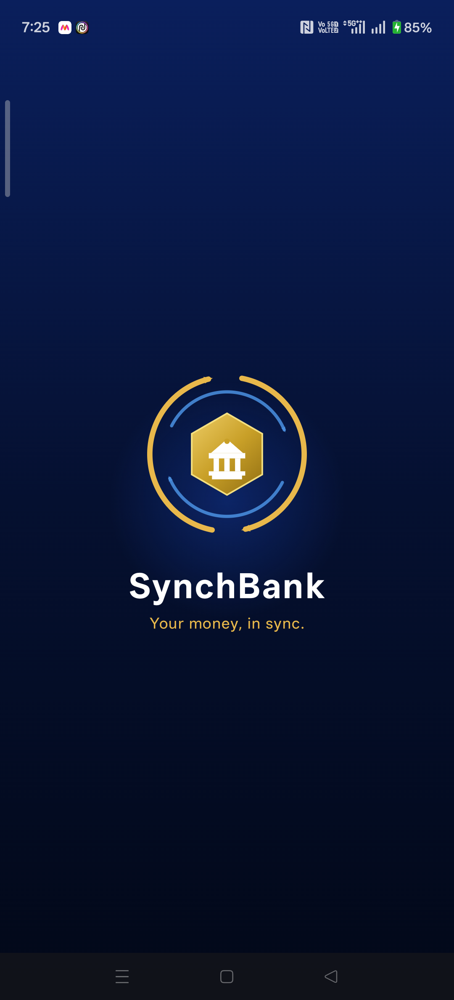<br/><sub><b>Splash Screen</b></sub></td>
    <td align="center">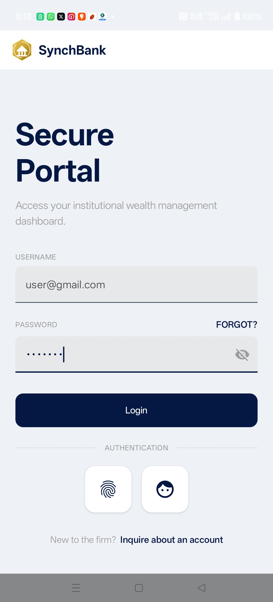<br/><sub><b>User Login</b></sub></td>
    <td align="center">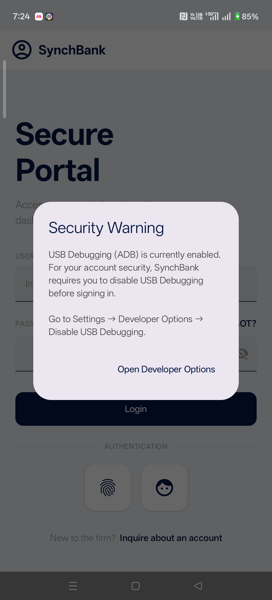<br/><sub><b>Security Warning — USB Debugging</b></sub></td>
  </tr>
  <tr>
    <td align="center">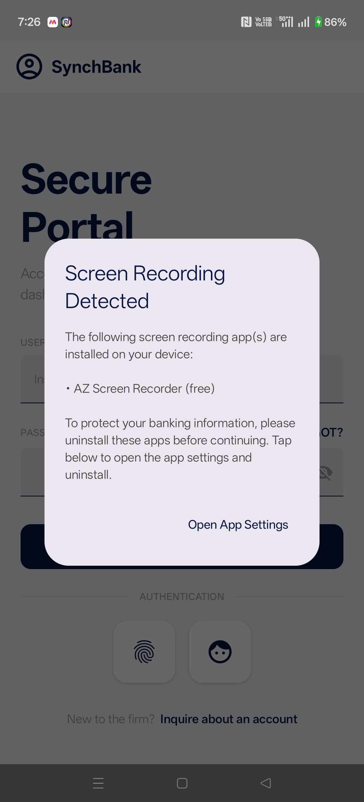<br/><sub><b>Screen Recorder Warning</b></sub></td>
    <td align="center">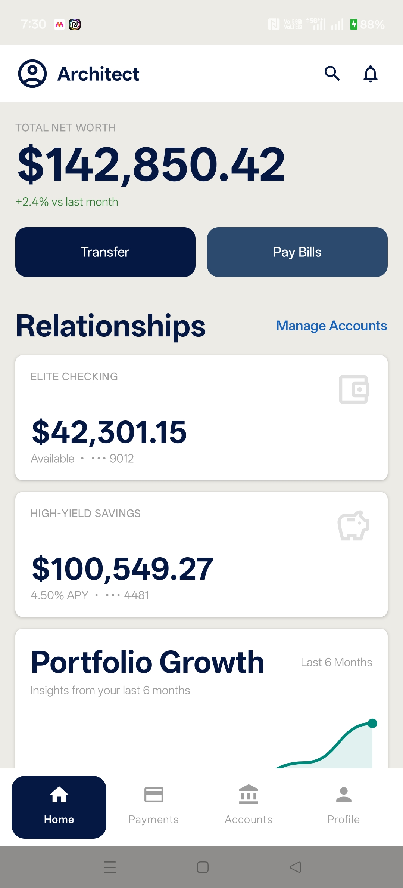<br/><sub><b>Dashboard</b></sub></td>
    <td align="center">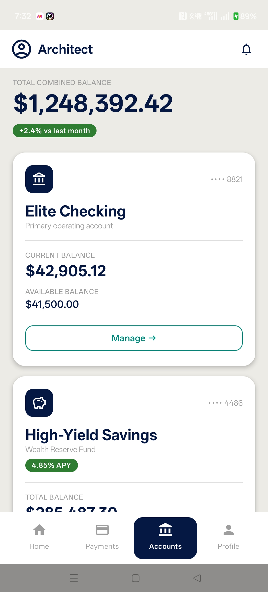<br/><sub><b>Accounts</b></sub></td>
  </tr>
  <tr>
    <td align="center">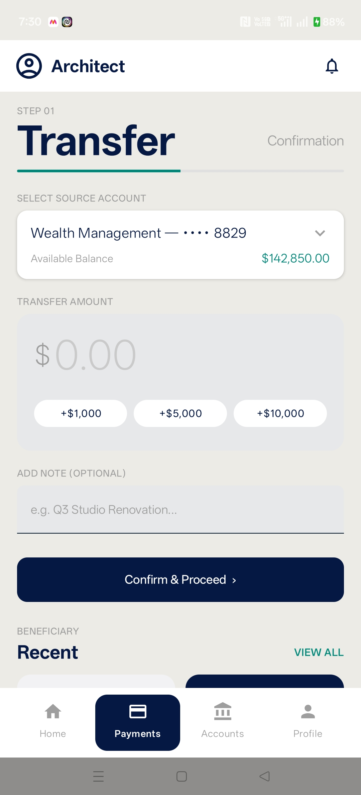<br/><sub><b>Transfer</b></sub></td>
    <td align="center">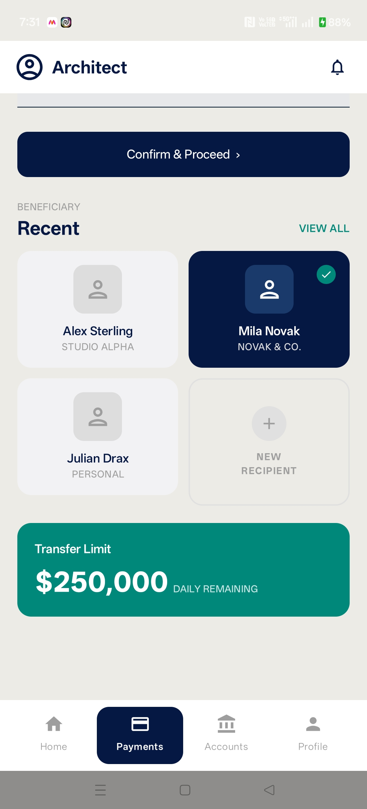<br/><sub><b>Beneficiary Selection</b></sub></td>
    <td align="center">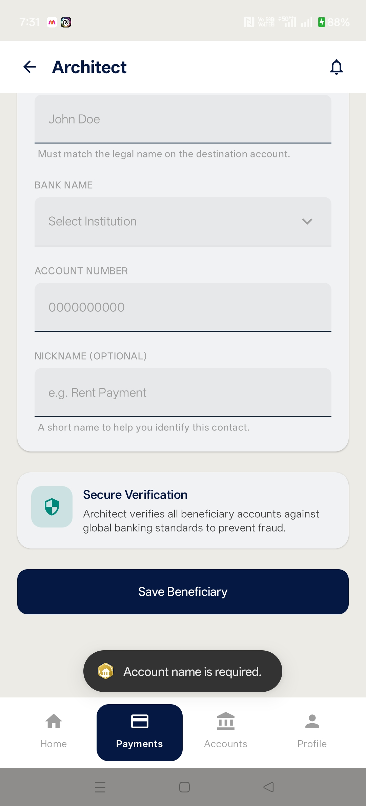<br/><sub><b>Adding Beneficiary</b></sub></td>
  </tr>
  <tr>
    <td align="center">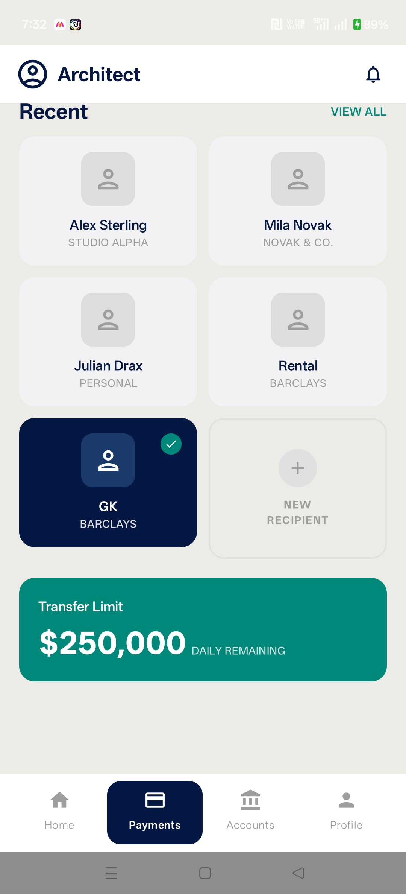<br/><sub><b>New Beneficiary Added</b></sub></td>
    <td align="center">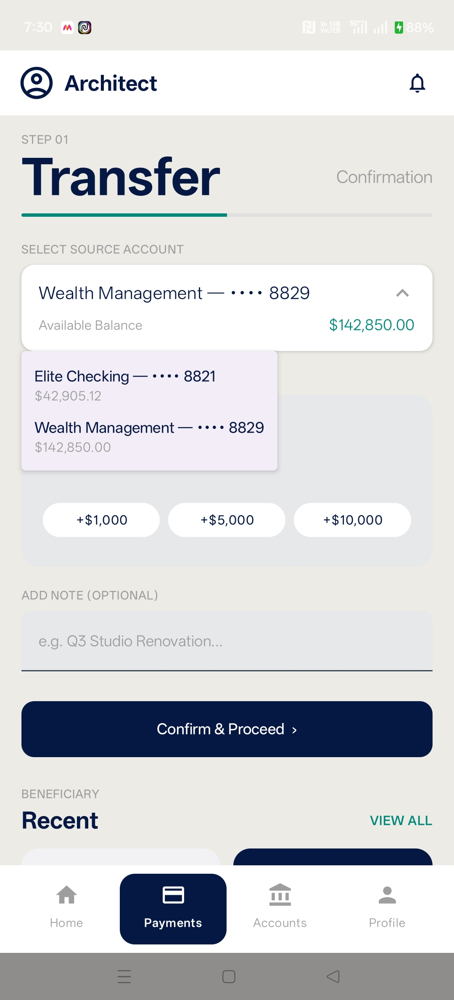<br/><sub><b>Account Selection</b></sub></td>
    <td align="center">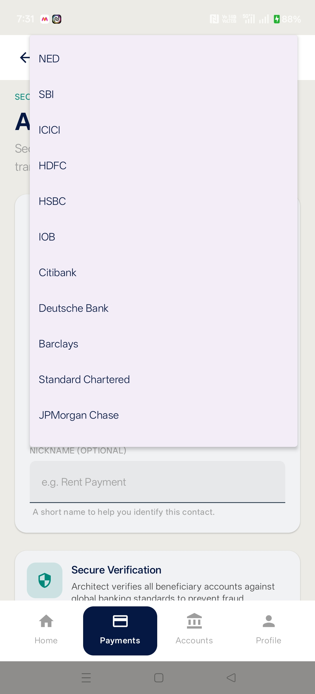<br/><sub><b>Bank Selection</b></sub></td>
  </tr>
  <tr>
    <td align="center">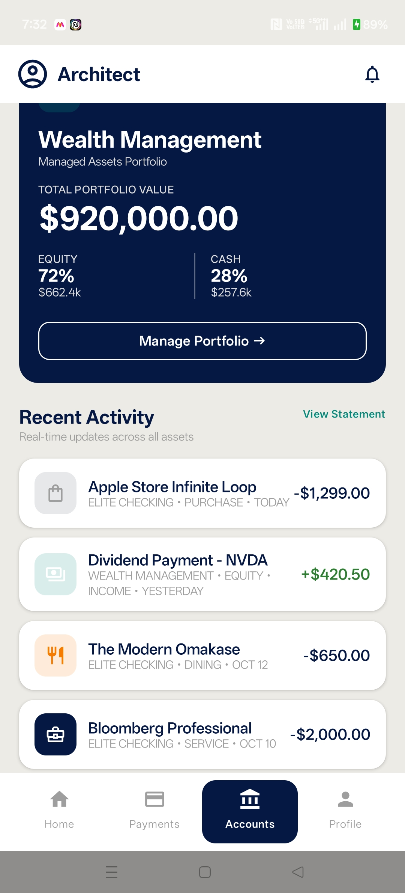<br/><sub><b>Wealth Management</b></sub></td>
    <td align="center">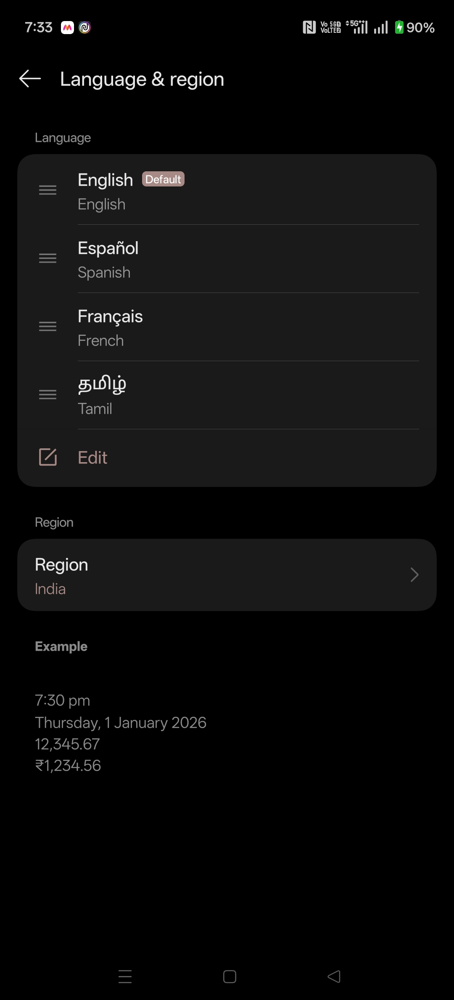<br/><sub><b>Language Selection</b></sub></td>
    <td align="center">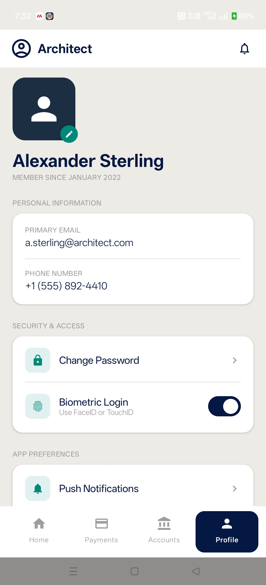<br/><sub><b>User Profile</b></sub></td>
  </tr>
  <tr>
    <td align="center">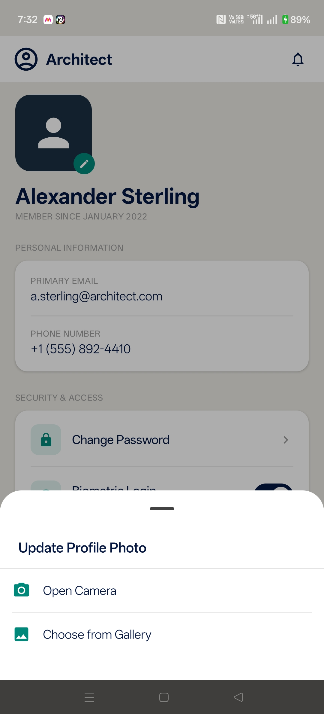<br/><sub><b>Update User Profile</b></sub></td>
    <td align="center">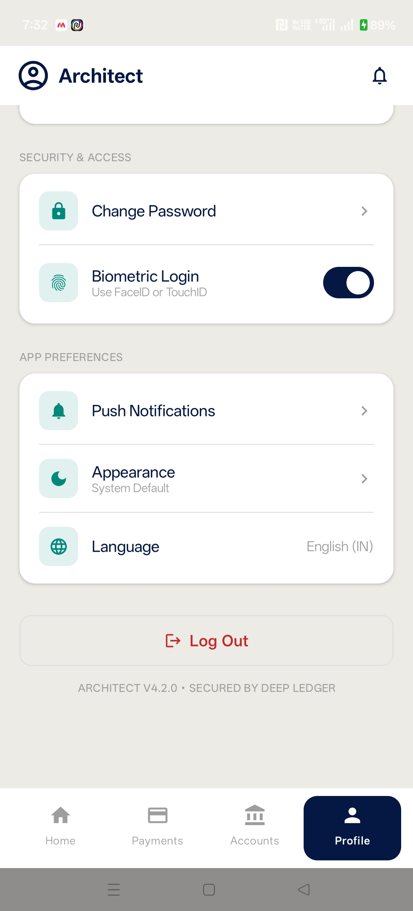<br/><sub><b>User Settings</b></sub></td>
    <td></td>
  </tr>
</table>

---

## 14. App Binary

Download the latest release APK and install directly on any Android device (minSdk 24+).

> **Note:** Enable **Install unknown apps** in your device settings before installing.

| | |
|---|---|
| **Version** | v1.0 |
| **Platform** | Android 7.0+ (API 24) |
| **Size** | ~10 MB |

[⬇ Download SynchBank v1.0 APK](https://github.com/gokulakrishnan2788/SynchBank/releases/download/v1.0/app-release.apk)
