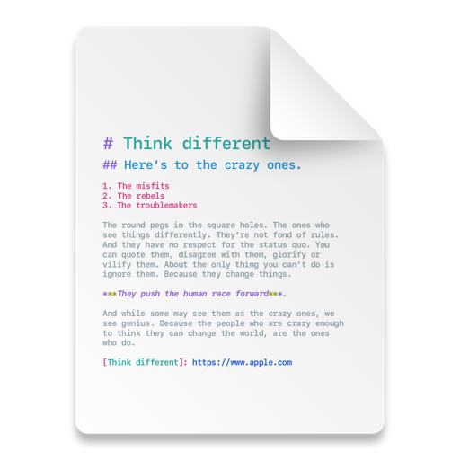

# Architect Banking App — Claude Workflow Cheatsheet
# Pin this. Reference every session.

## ─── PHASE 1: Project Setup (run once) ───────────────────────────────────

cat prompts/CONTEXT.md prompts/ARCHITECTURE.md prompts/DECISIONS.md \
    prompts/contract/naming.md prompts/contract/constraints.md | claude

./gradlew build
git add . && git commit -m "chore: project setup"

## ─── PHASE 2: Login Feature ✅ DONE ──────────────────────────────────────

# Step 1 — API layer
cat prompts/CONTEXT.md prompts/contract/api_contract.md \
    prompts/features/login/api.md | claude
./gradlew :feature:login:compileDebugKotlin

# Step 2 — DB layer (session)
cat prompts/CONTEXT.md prompts/contract/db_contract.md | claude
# (session table — only if not created in setup phase)

# Step 3 — Domain layer
cat prompts/CONTEXT.md prompts/contract/domain_contract.md \
    prompts/features/login/domain.md | claude
./gradlew :feature:login:compileDebugKotlin

# Step 4 — UI layer
cat prompts/CONTEXT.md prompts/contract/mvi.md prompts/contract/sdui_contract.md \
    prompts/contract/renderer.md prompts/features/login/contract.md \
    prompts/features/login/ui.md | claude
git diff   # ← ALWAYS review before building
./gradlew :feature:login:compileDebugKotlin

# Step 5 — Tests
cat prompts/CONTEXT.md prompts/contract/testing.md \
    prompts/features/login/test.md | claude
./gradlew :feature:login:testDebugUnitTest

# Step 6 — Validate
cat prompts/CONTEXT.md prompts/features/validate.md | claude

# Step 7 — Fix if needed (paste error into fix file first)
cat prompts/CONTEXT.md prompts/fixes/error_fix.md | claude    # Kotlin error
cat prompts/CONTEXT.md prompts/fixes/build_fix.md | claude    # Gradle error

# Step 8 — Commit
git add . && git commit -m "feat: login — SDUI + MVI + tests ✅"

## ─── PHASE 3: Composite Components (run ONCE before any main-flow feature) ──

# MUST complete before Phase 4–7.
# Generates all shared SDUI components + MainScreen bottom nav shell.
# Screenshot references used: all 5 screen PNGs in app/src/main/assets/screenshots/

cat prompts/CONTEXT.md prompts/contract/sdui_contract.md \
    prompts/contract/renderer.md \
    prompts/composite/composite_components.md | claude
   // prompts/composite/loading_skeleton.md

git diff
./gradlew :core:ui:compileDebugKotlin
./gradlew :engine:sdui:compileDebugKotlin
./gradlew :feature:dashboard:compileDebugKotlin
git add . && git commit -m "feat: composite components + MainScreen bottom nav ✅"

# Copy screenshots to project:
# app/src/main/assets/screenshots/Home_DashBoard.png
# app/src/main/assets/screenshots/Payments.png
# app/src/main/assets/screenshots/Accounts.png
# app/src/main/assets/screenshots/Add_Beneficiary.png
# app/src/main/assets/screenshots/_User_Profile.png

## ─── PHASE 4: Home Tab (Dashboard) ──────────────────────────────────────

# Step 1 — API
cat prompts/CONTEXT.md prompts/contract/api_contract.md \
    prompts/features/home/api.md | claude
./gradlew :feature:dashboard:compileDebugKotlin

# Step 2 — Domain
cat prompts/CONTEXT.md prompts/contract/domain_contract.md \
    prompts/features/home/domain.md | claude
./gradlew :feature:dashboard:compileDebugKotlin

# Step 3 — UI (Claude Code opens Home_DashBoard.png automatically)
cat prompts/CONTEXT.md prompts/contract/mvi.md prompts/contract/sdui_contract.md \
    prompts/contract/renderer.md prompts/composite/composite_components.md \
    prompts/features/home/contract.md prompts/features/home/feature.md \
    prompts/features/home/ui.md | claude
git diff
./gradlew :feature:dashboard:compileDebugKotlin

# Step 4 — Tests
cat prompts/CONTEXT.md prompts/contract/testing.md \
    prompts/features/home/test.md | claude
./gradlew :feature:dashboard:testDebugUnitTest

# Step 5 — Validate
cat prompts/CONTEXT.md prompts/features/validate.md \
    prompts/features/home/validate.md | claude

git add . && git commit -m "feat: home dashboard tab — SDUI + MVI + tests ✅"

## ─── PHASE 5: Payments Tab (Transfer + Add Beneficiary) ─────────────────

# Step 1 — API
cat prompts/CONTEXT.md prompts/contract/api_contract.md \
    prompts/features/payments/api.md | claude
./gradlew :feature:transfer:compileDebugKotlin

# Step 2 — Domain
cat prompts/CONTEXT.md prompts/contract/domain_contract.md \
    prompts/features/payments/domain.md | claude
./gradlew :feature:transfer:compileDebugKotlin

# Step 3 — UI (Claude Code opens Payments.png + Add_Beneficiary.png automatically)
cat prompts/CONTEXT.md prompts/contract/mvi.md prompts/contract/sdui_contract.md \
    prompts/contract/renderer.md prompts/composite/composite_components.md \
    prompts/features/payments/contract.md prompts/features/payments/feature.md \
    prompts/features/payments/ui.md | claude
git diff
./gradlew :feature:transfer:compileDebugKotlin

# Step 4 — Tests
cat prompts/CONTEXT.md prompts/contract/testing.md \
    prompts/features/payments/test.md | claude
./gradlew :feature:transfer:testDebugUnitTest

# Step 5 — Validate
cat prompts/CONTEXT.md prompts/features/validate.md \
    prompts/features/payments/validate.md | claude

git add . && git commit -m "feat: payments tab (transfer) — SDUI + MVI + tests ✅"

# Add Beneficiary sub-screen (same :feature:transfer module — no new module needed)
cat prompts/CONTEXT.md prompts/contract/mvi.md prompts/contract/sdui_contract.md \
    prompts/contract/renderer.md prompts/composite/composite_components.md \
    prompts/composite/loading_skeleton.md \
    prompts/features/add_beneficiary/feature.md \
    prompts/features/add_beneficiary/api.md \
    prompts/features/add_beneficiary/domain.md \
    prompts/features/add_beneficiary/contract.md \
    prompts/features/add_beneficiary/ui.md | claude
git diff
./gradlew :feature:transfer:compileDebugKotlin

cat prompts/CONTEXT.md prompts/contract/testing.md \
    prompts/features/add_beneficiary/test.md | claude
./gradlew :feature:transfer:testDebugUnitTest

cat prompts/CONTEXT.md prompts/features/validate.md \
    prompts/features/add_beneficiary/validate.md | claude

git add . && git commit -m "feat: add beneficiary sub-screen — SDUI + MVI + tests ✅"

## ─── PHASE 6: Accounts Tab ───────────────────────────────────────────────

# Step 1 — API
cat prompts/CONTEXT.md prompts/contract/api_contract.md \
    prompts/features/accounts/feature.md | claude
./gradlew :feature:accounts:compileDebugKotlin

# Step 2 — Domain
cat prompts/CONTEXT.md prompts/contract/domain_contract.md \
    prompts/features/accounts/feature.md | claude
./gradlew :feature:accounts:compileDebugKotlin

# Step 3 — UI (Claude Code opens Accounts.png automatically)
cat prompts/CONTEXT.md prompts/contract/mvi.md prompts/contract/sdui_contract.md \
    prompts/contract/renderer.md prompts/composite/composite_components.md \
    prompts/features/accounts/feature.md | claude
git diff
./gradlew :feature:accounts:compileDebugKotlin

# Step 4 — Tests
cat prompts/CONTEXT.md prompts/contract/testing.md \
    prompts/features/accounts/feature.md | claude
./gradlew :feature:accounts:testDebugUnitTest

# Step 5 — Validate
cat prompts/CONTEXT.md prompts/features/validate.md \
    prompts/features/accounts/feature.md | claude

git add . && git commit -m "feat: accounts tab — SDUI + MVI + tests ✅"

## ─── PHASE 7: Profile Tab ────────────────────────────────────────────────

# Step 1 — API
cat prompts/CONTEXT.md prompts/contract/api_contract.md \
    prompts/features/profile/feature.md | claude
./gradlew :feature:profile:compileDebugKotlin

# Step 2 — Domain
cat prompts/CONTEXT.md prompts/contract/domain_contract.md \
    prompts/features/profile/feature.md | claude
./gradlew :feature:profile:compileDebugKotlin

# Step 3 — UI (Claude Code opens _User_Profile.png automatically)
cat prompts/CONTEXT.md prompts/contract/mvi.md prompts/contract/sdui_contract.md \
    prompts/contract/renderer.md prompts/composite/composite_components.md \
    prompts/features/profile/feature.md | claude
git diff
./gradlew :feature:profile:compileDebugKotlin

# Step 4 — Tests
cat prompts/CONTEXT.md prompts/contract/testing.md \
    prompts/features/profile/feature.md | claude
./gradlew :feature:profile:testDebugUnitTest

# Step 5 — Validate
cat prompts/CONTEXT.md prompts/features/validate.md \
    prompts/features/profile/feature.md | claude

git add . && git commit -m "feat: profile tab — SDUI + MVI + tests ✅"

## ─── PHASE 8: Wire Navigation ────────────────────────────────────────────

cat prompts/CONTEXT.md prompts/contract/navigation.md | claude

# navigation_config.json additions:
# login → onSuccess → home (MainScreen)
# home  → transfer btn → payments tab
# payments → add beneficiary → add_beneficiary sub-screen
# profile → logout → login (popUpTo inclusive)

./gradlew :app:compileDebugKotlin
git add . && git commit -m "feat: wire full navigation ✅"

## ─── ADDING NEW SDUI COMPONENT TYPE ──────────────────────────────────────

cat prompts/CONTEXT.md prompts/contract/renderer.md prompts/contract/sdui_contract.md \
    | claude
# Describe the new component type needed

## ─── PHASE 9: Final Docs ─────────────────────────────────────────────────

cat prompts/CONTEXT.md prompts/docs/generate_docs.md | claude
# Add "Document ALL features including home, payments, accounts, profile" at the end

## ─── QUICK REFERENCE ─────────────────────────────────────────────────────

# Always load:             CONTEXT.md
# Composite (once):        + composite/composite_components.md
# For new feature UI:      + contract/mvi.md + contract/sdui_contract.md
#                          + contract/renderer.md + composite/composite_components.md
#                          + features/FEATURE/contract.md + features/FEATURE/feature.md + features/FEATURE/ui.md
# For API work:            + contract/api_contract.md + features/FEATURE/api.md (or feature.md)
# For DB work:             + contract/db_contract.md
# For domain/usecase:      + contract/domain_contract.md + features/FEATURE/domain.md (or feature.md)
# For tests:               + contract/testing.md + features/FEATURE/test.md (or feature.md)
# For routing:             + contract/navigation.md
# For renderer:            + contract/renderer.md
# For errors:              + fixes/error_fix.md  (paste error in file)
# For build errors:        + fixes/build_fix.md  (paste gradle output)
# For docs:                + docs/generate_docs.md

## ─── TOKEN SAVING RULES ──────────────────────────────────────────────────
# 1. CONTEXT.md must stay under 50 lines — trim if it grows
# 2. One layer per session (api OR domain OR ui — not all at once)
# 3. Never paste full files into claude — paste only error messages
# 4. Commit after each layer so git diff stays small and focused
# 5. Use ./gradlew :feature:X:task (not root ./gradlew) to save build time
# 6. Use Haiku model for error fixes, Sonnet for generation
# 7. Phase 3 (composite) must always precede Phases 4–7
# 8. feature.md contains ALL layers for accounts/profile — use it directly

## ─── AUTOMATED WORKFLOW (run_workflow.sh) ────────────────────────────────

# Script location — project root (same level as gradlew):
# SynchBank/
# ├── gradlew
# ├── run_workflow.sh        ← here
# ├── prompts/
# └── ...

# Make executable (one time only):
chmod +x run_workflow.sh

# Since Phase 1 & 2 (login) are already done:
./run_workflow.sh --skip-login

# After manually fixing an error:
./run_workflow.sh --resume

# Other commands:
./run_workflow.sh --list          # show all step statuses
./run_workflow.sh --only phase5   # run single phase only
./run_workflow.sh --from phase6   # resume from specific phase
./run_workflow.sh --reset         # clear all checkpoints

# Checkpoint files (add to .gitignore):
echo ".workflow_checkpoint" >> .gitignore
echo ".workflow_checkpoint.log" >> .gitignore
echo "logs/workflow/" >> .gitignore
